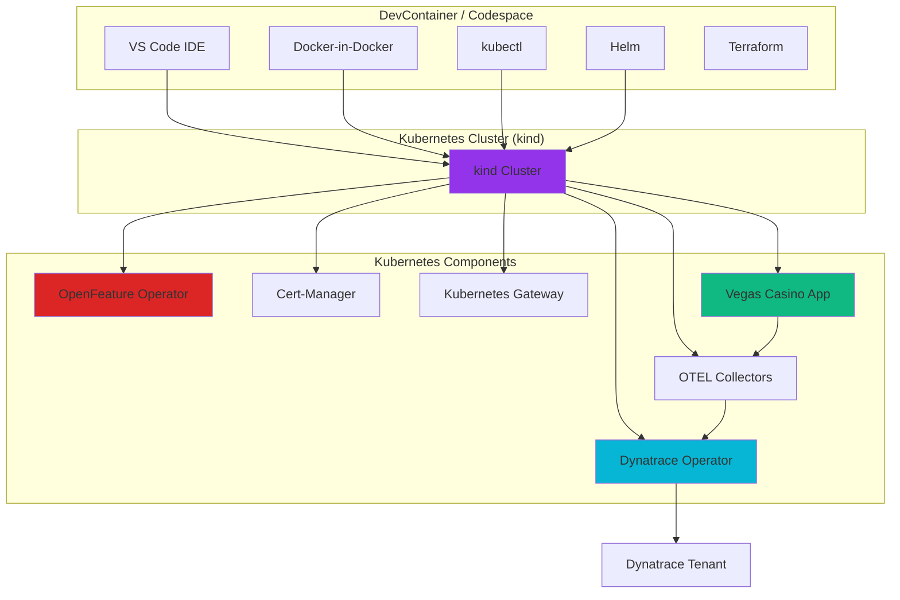

# DevContainer Environment

## Overview

The hackathon environment runs entirely in a **GitHub Codespace** (or local DevContainer) that provides a complete, pre-configured development and deployment environment. Everything you need is automatically set up when the Codespace launches.

## Environment Components

The DevContainer environment includes:



## Component Details

### 1. Kind Cluster

**What it is**: A local Kubernetes cluster running inside your Codespace using [kind](https://kind.sigs.k8s.io/) (Kubernetes in Docker).

**Purpose**: Provides a complete Kubernetes environment for deploying the Vegas Casino application.

**Configuration**: 
- Defined in `.devcontainer/kind-cluster.yaml`
- Automatically created during Codespace initialization
- Runs on a single node (sufficient for hackathon purposes)

**Access**:
```bash
# Check cluster status
kubectl cluster-info
kubectl get nodes

# View all pods
kubectl get pods -A
```

### 2. OpenFeature Operator

**What it is**: Kubernetes operator that manages feature flags using the OpenFeature standard.

**Purpose**: 
- Automatically injects `flagd` sidecars into application pods
- Manages `FeatureFlag` and `FeatureFlagSource` CRDs
- Enables dynamic feature flag management without redeploying services

**Installation**: Automatically installed during Codespace setup via Helm.

**Resources**:
- Namespace: `open-feature-system`
- CRDs: `FeatureFlag`, `FeatureFlagSource`

**Verification**:
```bash
# Check operator status
kubectl get pods -n open-feature-system

# Verify CRDs
kubectl get crd | grep openfeature
```

See [Feature Flags Guide](../development/feature-flags.md) for details on available flags.

### 3. Cert-Manager

**What it is**: Kubernetes operator for managing TLS certificates automatically.

**Purpose**: 
- Issues and manages TLS certificates for the Gateway
- Provides automatic certificate renewal
- Required for HTTPS endpoints

**Installation**: Automatically installed during Codespace setup.

**Resources**:
- Namespace: `cert-manager`
- CRDs: `Certificate`, `Issuer`, `ClusterIssuer`

**Verification**:
```bash
# Check cert-manager status
kubectl get pods -n cert-manager

# View certificates
kubectl get certificates -A
```

### 4. Kubernetes Gateway API

**What it is**: Modern Kubernetes API for managing ingress and load balancing.

**Purpose**:
- Provides external access to the Vegas Casino application
- Manages routing and TLS termination
- Replaces traditional Ingress controllers

**Components**:
- **Gateway**: Defines entry points and listeners
- **HTTPRoute**: Defines routing rules
- **GatewayClass**: Defines gateway implementation

**Resources**:
- Gateway: `vegas-casino-gateway` in `vegas-casino` namespace
- HTTPRoute: Routes traffic to frontend and dashboard services

**Access**:
```bash
# Get gateway external IP
kubectl get gateway vegas-casino-gateway -n vegas-casino

# View HTTP routes
kubectl get httproute -n vegas-casino
```

### 5. Vegas Casino Application

**What it is**: The main application stack consisting of:

- **Frontend Service**: Web UI (Node.js/Express)
- **Game Services**: Slots, Roulette, Dice, Blackjack
- **Scoring Service**: Leaderboards (Java/Spring Boot)
- **Dashboard Service**: Analytics (Node.js)
- **Supporting Services**: Redis, PostgreSQL

**Deployment**: Deployed via Helm chart in the `vegas-casino` namespace.

**Access**:
```bash
# View all application pods
kubectl get pods -n vegas-casino

# Access via port forwarding
kubectl port-forward -n vegas-casino svc/vegas-casino-frontend 3000:3000
```

### 6. OpenTelemetry Collectors

**What it is**: Collectors that receive, process, and export telemetry data.

**Purpose**:
- Receives traces, metrics, and logs from application services
- Processes and enriches telemetry data
- Exports to Dynatrace via the Dynatrace Operator

**Deployment**: 
- **DaemonSet**: One collector per node (for node-level metrics)
- **StatefulSet**: Centralized collector for application telemetry

**Configuration**: Defined in `codespace/manifests/otel-collector-*.yaml`

**Verification**:
```bash
# Check collector pods
kubectl get pods -n default -l app=otel-collector

# View collector logs
kubectl logs -n default -l app=otel-collector
```

### 7. Dynatrace Operator

**What it is**: Kubernetes operator that manages Dynatrace OneAgent and ActiveGate.

**Purpose**:
- Automatically injects OneAgent into application pods
- Manages ActiveGate for metrics and traces export
- Configures Dynatrace monitoring for the cluster

**Configuration**: 
- Requires Dynatrace environment credentials (provided via Codespace secrets)
- Automatically configured during Codespace initialization

**Resources**:
- Namespace: `dynatrace`
- CRDs: `Dynakube`, `ActiveGate`

**Verification**:
```bash
# Check Dynatrace operator
kubectl get pods -n dynatrace

# View Dynakube status
kubectl get dynakube -n dynatrace
```

## Initialization Process

When your Codespace launches, the following happens automatically:

1. **System Setup** (`.devcontainer/post_create.sh`):
   - Installs kubectl, Helm, kind, Terraform
   - Sets up Docker-in-Docker
   - Creates kind cluster

2. **Terraform Configuration** (`codespace/configuration/init.sh`):
   - Configures Dynatrace tokens and credentials
   - Sets up Kubernetes resources
   - Installs operators (OpenFeature, Cert-Manager, Gateway API, Dynatrace)

3. **Application Deployment** (`codespace/deployment.sh`):
   - Deploys Vegas Casino application via Helm
   - Configures feature flags
   - Sets up Gateway and routing

## Environment Variables

The Codespace requires these secrets (configured in GitHub Codespace settings):

| Variable | Description | Example |
|----------|-------------|---------|
| `DYNATRACE_ENVIRONMENT_ID` | Environment ID from Dynatrace URL | `abc12345` |
| `DYNATRACE_ENVIRONMENT` | Environment type | `live`, `sprint`, or `dev` |
| `DYNATRACE_API_TOKEN` | API token with `apiTokens.read` & `apiTokens.write` | `dt0c01.xxx` |
| `DYNATRACE_PLATFORM_TOKEN` | Platform token with `davis-copilot:conversations:execute` | `dt0c01.xxx` |
| `DYNATRACE_OAUTH_CLIENT_ID` | OAuth client ID | `xxx` |
| `DYNATRACE_OAUTH_CLIENT_SECRET` | OAuth client secret | `xxx` |
| `DYNATRACE_ACCOUNT_ID` | Dynatrace account ID | `xxx` |

## Accessing the Application

### Via Port Forwarding (Recommended)

```bash
# Forward frontend service
kubectl port-forward -n vegas-casino svc/vegas-casino-frontend 3000:3000

# Access at http://localhost:3000
```

### Via Gateway (if external IP available)

```bash
# Get gateway address
kubectl get gateway vegas-casino-gateway -n vegas-casino \
  -o jsonpath='{.status.addresses[0].value}'

# Access via the returned IP
```

## Troubleshooting

### Operators Not Running

```bash
# Check OpenFeature operator
kubectl get pods -n open-feature-system

# Check Dynatrace operator
kubectl get pods -n dynatrace

# Check cert-manager
kubectl get pods -n cert-manager
```

### Application Not Deploying

```bash
# Check Helm release status
helm list -n vegas-casino

# View pod status
kubectl get pods -n vegas-casino

# Check pod logs
kubectl logs -n vegas-casino <pod-name>
```

### Telemetry Not Flowing

```bash
# Check OTEL collectors
kubectl get pods -l app=otel-collector

# Check Dynatrace operator
kubectl get dynakube -n dynatrace

# Verify credentials
kubectl get secret -n dynatrace
```

## Next Steps

- [Deployment Architecture](index.md): Learn about the deployment structure
- [Development Guide](../development/source-code.md): Understand how to make changes
- [Feature Flags Guide](../development/feature-flags.md): Learn about feature flags
