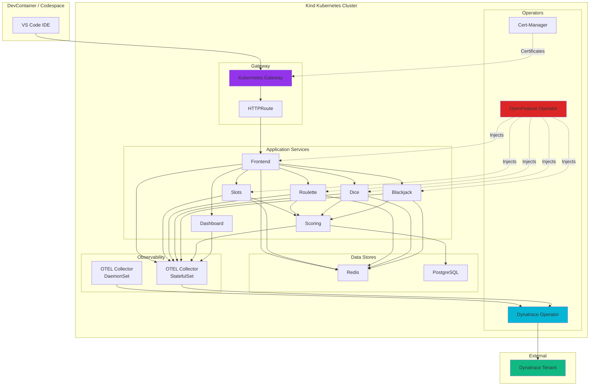

# Deployment Architecture

## Overview

The Vegas Casino application is deployed in a **kind Kubernetes cluster** running inside your DevContainer/Codespace. All components are automatically set up when your Codespace launches.

## Architecture Diagram



## Deployment Components

### 1. Infrastructure Layer

- **Kind Cluster**: Local Kubernetes cluster (single node)
- **OpenFeature Operator**: Manages feature flags and flagd sidecars
- **Cert-Manager**: Issues TLS certificates for Gateway
- **Kubernetes Gateway**: Modern ingress API for external access
- **Dynatrace Operator**: Manages OneAgent and ActiveGate

### 2. Application Layer

All services deployed in `vegas-casino` namespace:

- **Frontend**: Web UI (Node.js/Express) - Port 3000
- **Game Services**: Slots, Roulette, Dice, Blackjack
- **Scoring**: Leaderboards (Java/Spring Boot) - Port 8085
- **Dashboard**: Analytics (Node.js) - Port 3001

### 3. Data Layer

- **Redis**: User sessions, game state, balances
- **PostgreSQL**: Game results, leaderboards, statistics

### 4. Observability Layer

- **OTEL Collector (DaemonSet)**: Node-level metrics
- **OTEL Collector (StatefulSet)**: Application telemetry
- **Dynatrace Operator**: Exports to Dynatrace tenant

## Automatic Setup

When your Codespace launches, the following happens automatically:

1. **Kind cluster created** (`.devcontainer/post_create.sh`)
2. **Operators installed** (`codespace/configuration/init.sh`):
   - OpenFeature Operator
   - Cert-Manager
   - Gateway API
   - Dynatrace Operator
3. **Application deployed** (`codespace/deployment.sh`):
   - Helm chart deployment
   - Feature flags configured
   - Gateway and routing set up

## Deployment Method

The application is deployed using **Helm charts**:

- **Chart Location**: `helm/vegas-casino/`
- **Values File**: `helm/vegas-casino/values.yaml`
- **Namespace**: `vegas-casino`

## Accessing the Application

### Port Forwarding (Recommended)

```bash
# Forward frontend service
kubectl port-forward -n vegas-casino svc/vegas-casino-frontend 3000:3000

# Access at http://localhost:3000
```

### Via Gateway

```bash
# Get gateway address (if available)
kubectl get gateway vegas-casino-gateway -n vegas-casino \
  -o jsonpath='{.status.addresses[0].value}'
```

## Verifying Deployment

### Check All Components

```bash
# Check operators
kubectl get pods -n open-feature-system
kubectl get pods -n cert-manager
kubectl get pods -n dynatrace

# Check application
kubectl get pods -n vegas-casino

# Check services
kubectl get svc -n vegas-casino

# Check gateway
kubectl get gateway -n vegas-casino
kubectl get httproute -n vegas-casino

# Check feature flags
kubectl get featureflag -n vegas-casino
kubectl get featureflagsource -n vegas-casino

# Check OTEL collectors
kubectl get pods -l app=otel-collector
```

## Updating the Deployment

After making code changes:

1. **Push changes** to your forked repository
2. **GitHub Actions builds** new Docker images
3. **Update Helm deployment** with new images

See [Updating with Helm](../development/helm-updates.md) for details.

## Component Details

For detailed information about each component:

- **[DevContainer Environment](devcontainer.md)**: Complete environment overview
- **[OpenFeature Operator](openfeature.md)**: Feature flag management
- **[Helm Charts](helm.md)**: Deployment configuration

## Troubleshooting

### Pods Not Starting

```bash
# Check pod status
kubectl describe pod <pod-name> -n vegas-casino

# Check logs
kubectl logs <pod-name> -n vegas-casino

# Check events
kubectl get events -n vegas-casino --sort-by='.lastTimestamp'
```

### Services Not Accessible

```bash
# Check service endpoints
kubectl get endpoints -n vegas-casino

# Test service connectivity
kubectl run -it --rm debug --image=curlimages/curl --restart=Never -- \
  curl http://vegas-casino-frontend:3000/health
```

### Telemetry Not Flowing

```bash
# Check OTEL collectors
kubectl get pods -l app=otel-collector

# Check collector logs
kubectl logs -l app=otel-collector

# Check Dynatrace operator
kubectl get dynakube -n dynatrace
kubectl describe dynakube -n dynatrace
```

## Next Steps

- [DevContainer Environment](devcontainer.md): Learn about the complete environment setup
- [Development Guide](../development/source-code.md): Understand how to make changes
- [Feature Flags Guide](../development/feature-flags.md): Learn about feature flags
