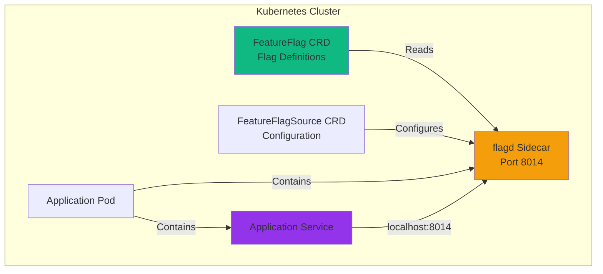

# Feature Flags Guide

## Overview

The Vegas Casino application uses **OpenFeature** with **flagd** for feature flag management. Feature flags allow you to enable/disable features dynamically without redeploying services.

## How Feature Flags Work



1. **FeatureFlag CRD**: Defines available flags and their values
2. **FeatureFlagSource CRD**: Configures flagd sidecar
3. **flagd Sidecar**: Injected into pods automatically by OpenFeature Operator
4. **Application**: Connects to flagd via `localhost:8014` to evaluate flags

## Available Feature Flags

### Slots Game Flags

| Flag Name | Default | Description |
|-----------|---------|-------------|
| `slots.progressive-jackpot` | `true` | Enable/disable progressive jackpot |
| `slots.bonus-rounds` | `true` | Enable/disable bonus rounds |
| `slots.cheat-detection` | `true` | Enable/disable cheat detection |
| `slots.min-bet` | `10` | Minimum bet amount (variants: 5, 10, 20) |
| `slots.max-bet` | `1000` | Maximum bet amount (variants: 500, 1000, 2000) |

### Roulette Game Flags

| Flag Name | Default | Description |
|-----------|---------|-------------|
| `roulette.multiple-bets` | `true` | Allow multiple simultaneous bets |
| `roulette.live-wheel` | `true` | Enable live wheel animation |
| `roulette.cheat-detection` | `true` | Enable cheat codes |

### Blackjack Game Flags

| Flag Name | Default | Description |
|-----------|---------|-------------|
| `blackjack.double-down` | `true` | Enable double down option |
| `blackjack.insurance` | `true` | Enable insurance bets |
| `blackjack.surrender` | `false` | Enable surrender option |

### Dice Game Flags

| Flag Name | Default | Description |
|-----------|---------|-------------|
| `dice.pass-line` | `true` | Enable pass-line bets |
| `dice.come-bets` | `false` | Enable come bets |

### Casino-Wide Flags

| Flag Name | Default | Description |
|-----------|---------|-------------|
| `casino.house-advantage` | `false` | **House Advantage Mode**: When enabled, reduces win probability across all games to protect casino profits. This flag is **NOT displayed in the UI** and should only be enabled via FeatureFlag CRD or Helm values. Use with caution as it affects all games. |

## Viewing Current Flags

### Via kubectl

```bash
# List all feature flags
kubectl get featureflag -n vegas-casino

# View flag details
kubectl get featureflag vegas-casino-flags -n vegas-casino -o yaml

# Describe flag
kubectl describe featureflag vegas-casino-flags -n vegas-casino
```

### Via Helm Values

Flags are defined in `helm/vegas-casino/values.yaml`:

```yaml
flagd:
  slots:
    progressive-jackpot:
      state: ENABLED
      defaultVariant: "true"
  roulette:
    multiple-bets:
      state: ENABLED
      defaultVariant: "true"
  # Casino-wide feature flags (not displayed in UI)
  casino:
    house-advantage:
      state: ENABLED
      defaultVariant: "false"  # Set to "true" to enable house advantage mode
```

## Enabling/Disabling Flags

### Method 1: Edit FeatureFlag CRD Directly

```bash
# Edit the FeatureFlag resource
kubectl edit featureflag vegas-casino-flags -n vegas-casino
```

Update the flag value:

```yaml
spec:
  flagSpec:
    flags:
      "slots.progressive-jackpot":
        state: ENABLED
        defaultVariant: "false"  # Changed from "true" to "false"
```

Save and exit. The flagd sidecar will automatically reload the configuration.

### Method 2: Update Helm Values

1. Edit `helm/vegas-casino/values.yaml`:

```yaml
flagd:
  slots:
    progressive-jackpot:
      state: ENABLED
      defaultVariant: "false"  # Disable progressive jackpot
```

2. Upgrade Helm release:

```bash
helm upgrade vegas-casino ./helm/vegas-casino \
  --namespace vegas-casino \
  --reuse-values
```

### Method 3: Use kubectl patch

```bash
# Disable progressive jackpot
kubectl patch featureflag vegas-casino-flags -n vegas-casino \
  --type merge \
  -p '{"spec":{"flagSpec":{"flags":{"slots.progressive-jackpot":{"defaultVariant":"false"}}}}}'
```

## Using Variants

Some flags support multiple variants (e.g., min-bet, max-bet):

### Example: Change Min Bet

```yaml
spec:
  flagSpec:
    flags:
      "slots.min-bet":
        state: ENABLED
        defaultVariant: "20"  # Change from "10" to "20"
        variants:
          "5": 5
          "10": 10
          "20": 20
```

## Verifying Flag Changes

### Check flagd Logs

```bash
# View flagd sidecar logs
kubectl logs <pod-name> -c flagd -n vegas-casino

# Look for reload messages
kubectl logs <pod-name> -c flagd -n vegas-casino | grep "reload"
```

### Test Flag Evaluation

```bash
# Exec into pod
kubectl exec -it <pod-name> -n vegas-casino -c <service-container> -- /bin/sh

# Test flag evaluation (if service supports it)
curl http://localhost:8014/schema/v1/flags
```

### Check Application Behavior

After changing flags, test the application:

```bash
# Port forward to frontend
kubectl port-forward -n vegas-casino svc/vegas-casino-frontend 3000:3000

# Open browser and test feature
# E.g., play slots and verify progressive jackpot is disabled
```

## Flag States

Flags can be in three states:

- **ENABLED**: Flag is active and can be evaluated
- **DISABLED**: Flag is inactive (returns default variant)
- **ARCHIVED**: Flag is removed (not recommended for hackathon)

## Targeting Rules

Flags support targeting rules for A/B testing (advanced):

```yaml
spec:
  flagSpec:
    flags:
      "slots.progressive-jackpot":
        state: ENABLED
        defaultVariant: "false"
        variants:
          "true": true
          "false": false
        targeting:
          # Enable for specific users
          if:
            - user == "vip-player":
              variant: "true"
```

## Troubleshooting

### Flag Not Updating

```bash
# Check FeatureFlag resource
kubectl get featureflag vegas-casino-flags -n vegas-casino -o yaml

# Check flagd sidecar
kubectl get pods -n vegas-casino -o jsonpath='{range .items[*]}{.metadata.name}{"\t"}{.spec.containers[*].name}{"\n"}{end}' | grep flagd

# Restart pod to force reload
kubectl delete pod <pod-name> -n vegas-casino
```

### Sidecar Not Injected

```bash
# Check pod annotations
kubectl describe pod <pod-name> -n vegas-casino | grep openfeature

# Should see:
# openfeature.dev/enabled: "true"
# openfeature.dev/featureflagsource: "vegas-casino/vegas-casino-flag-source"

# Check FeatureFlagSource
kubectl get featureflagsource -n vegas-casino
```

### Application Can't Connect to flagd

```bash
# Check flagd is running
kubectl get pods -n vegas-casino -o jsonpath='{range .items[*]}{.metadata.name}{"\t"}{.spec.containers[*].name}{"\n"}{end}'

# Check flagd logs
kubectl logs <pod-name> -c flagd -n vegas-casino

# Verify port 8014 is open
kubectl exec -it <pod-name> -n vegas-casino -c <service-container> -- \
  nc -zv localhost 8014
```

## Best Practices

1. **Use Descriptive Names**: Flag names should clearly indicate their purpose
2. **Document Flags**: Add comments in Helm values explaining flag purpose
3. **Test Changes**: Always test flag changes before enabling in production
4. **Monitor Impact**: Watch application metrics after changing flags
5. **Clean Up**: Remove unused flags to reduce complexity

## Example: Disable Progressive Jackpot

```bash
# 1. Edit FeatureFlag
kubectl edit featureflag vegas-casino-flags -n vegas-casino

# 2. Change defaultVariant to "false"
#    Save and exit

# 3. Verify change
kubectl get featureflag vegas-casino-flags -n vegas-casino -o yaml | grep -A 5 progressive-jackpot

# 4. Test in application
kubectl port-forward -n vegas-casino svc/vegas-casino-frontend 3000:3000
# Play slots and verify progressive jackpot is disabled
```

## Example: Enable House Advantage Mode

!!! warning "House Advantage Mode"
    **Use with caution!** This flag reduces win probability across **all games** to protect casino profits. It's designed for casino managers to enable during high-traffic periods or when profits need protection.

### Via Helm Values

1. Edit `helm/vegas-casino/values.yaml`:

```yaml
flagd:
  casino:
    house-advantage:
      state: "ENABLED"
      defaultVariant: "true"  # Enable house advantage
```

2. Upgrade Helm release:

```bash
helm upgrade vegas-casino ./helm/vegas-casino \
  --namespace vegas-casino \
  --reuse-values
```

### Via FeatureFlag CRD

```bash
# Edit the FeatureFlag resource
kubectl edit featureflag vegas-casino-flags -n vegas-casino
```

Update the flag:

```yaml
spec:
  flagSpec:
    flags:
      "casino.house-advantage":
        state: ENABLED
        defaultVariant: "true"  # Enable house advantage
```

### Verify House Advantage is Active

```bash
# Check flag value
kubectl get featureflag vegas-casino-flags -n vegas-casino -o yaml | grep -A 5 house-advantage

# Test in application - play games and observe reduced win rates
kubectl port-forward -n vegas-casino svc/vegas-casino-frontend 3000:3000
```

!!! note "Important"
    - This flag affects **all games** (Slots, Roulette, Dice, Blackjack)
    - The flag is **not visible in the UI** - it's a backend-only control
    - Changes take effect immediately after flagd reloads (usually within seconds)
    - Monitor game statistics after enabling to verify the impact

## Next Steps

- [Source Code Locations](source-code.md): Find where flags are used in code
- [Updating with Helm](helm-updates.md): Learn how to update deployments
- [DevContainer Environment](../deployment/devcontainer.md): Understand the environment
