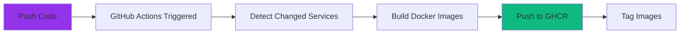

# GitHub Actions Workflow

## Overview

The repository uses GitHub Actions to automatically build Docker images when you push code changes. **You don't need to build images manually** - everything happens automatically in the cloud.

## Workflow Files

The CI/CD pipeline consists of several workflows:

- **`.github/workflows/docker-build.yml`**: Builds Docker images for all services
- **`.github/workflows/ci-cd.yml`**: Main CI/CD pipeline
- **`.github/workflows/sbom.yml`**: Generates Software Bill of Materials
- **`.github/workflows/security-scan.yml`**: Security scanning

## How It Works

### 1. Trigger on Push

When you push changes to your forked repository, GitHub Actions automatically:



### 2. Build Process

For each modified service, the workflow:

1. **Detects Changes**: Checks which service directories have changes
2. **Builds Image**: Uses Docker Buildx to build multi-platform images
3. **Tags Image**: Tags with:
   - `latest` - Latest build
   - `{commit-sha}` - Specific commit
   - `{branch-name}` - Branch name (if not main)
4. **Pushes to Registry**: Uploads to GitHub Container Registry (GHCR)

### 3. Image Naming Convention

Images are named using this pattern:

```
ghcr.io/{your-username}/vegasapp-{service}:{tag}
```

**Examples**:
- `ghcr.io/yourusername/vegasapp-frontend:latest`
- `ghcr.io/yourusername/vegasapp-slots:abc1234`
- `ghcr.io/yourusername/vegasapp-roulette:main`

## Viewing Build Status

### GitHub Actions Tab

1. Go to your forked repository on GitHub
2. Click the **Actions** tab
3. View workflow runs and their status

### Build Logs

Click on a workflow run to see:
- Which services were built
- Build logs for each service
- Any errors or warnings
- Image tags created

## Manual Workflow Trigger

You can manually trigger the build workflow:

1. Go to **Actions** tab
2. Select **Docker Build** workflow
3. Click **Run workflow**
4. Select branch and click **Run workflow**

This is useful for:
- Rebuilding all images
- Testing the build process
- Initial setup after forking

## Image Registry

### GitHub Container Registry (GHCR)

All images are pushed to GitHub Container Registry:

- **URL**: `ghcr.io/{your-username}/vegasapp-{service}`
- **Access**: Public (for hackathon) or private
- **Authentication**: Uses `GITHUB_TOKEN` automatically

### Viewing Images

```bash
# List your images (requires GitHub CLI)
gh cr list

# Or view in GitHub UI
# Go to: https://github.com/{your-username}?tab=packages
```

## Updating Deployment

After images are built, update your Helm deployment:

See [Updating with Helm](helm-updates.md) for instructions.

## Troubleshooting

### Build Fails

**Check**:
1. Build logs in GitHub Actions
2. Dockerfile syntax
3. Dependencies in `package.json`, `requirements.txt`, `pom.xml`, etc.

**Common Issues**:
- Missing dependencies
- Syntax errors in Dockerfile
- Build timeout (increase timeout in workflow)

### Images Not Appearing

**Check**:
1. Workflow completed successfully
2. Images in GHCR: `https://github.com/{your-username}?tab=packages`
3. Correct image registry in Helm values

### Slow Builds

**Solutions**:
- Builds run in parallel for different services
- GitHub Actions provides free minutes (check usage)
- Consider building only changed services

## Workflow Configuration

### Build Matrix

The workflow builds images for:
- Frontend
- Slots
- Roulette
- Dice
- Blackjack
- Scoring
- Dashboard
- Gateway

### Build Settings

Configured in `.github/workflows/docker-build.yml`:

```yaml
- name: Build and push
  uses: docker/build-push-action@v5
  with:
    context: ./services/{service}
    push: true
    tags: ghcr.io/${{ github.repository_owner }}/vegasapp-{service}:latest
    platforms: linux/amd64
```

## Next Steps

- [Source Code Locations](source-code.md): Find where to make changes
- [Updating with Helm](helm-updates.md): Deploy your changes
- [Feature Flags Guide](feature-flags.md): Understand feature flags
