# 🎰 Welcome to the Vegas Casino Observability Hackathon!

## Quick Links

**[🏆 Hackathon Challenges](overview/hackathon-index.md)**  
View all hackathon challenges organized by track (GitHub Copilot and Dynatrace). Start your journey here!

**[💻 Development Workflow](development/source-code.md)**  
Understand how to make changes, build images, and deploy updates. Learn about the GitHub Actions workflow and Helm deployments.

**[☁️ Environment Setup](deployment/devcontainer.md)**  
Learn about the DevContainer environment and deployment architecture. Understand kind, OpenFeature, cert-manager, and more.

## 🎯 What is This Hackathon?

The **Vegas Casino Observability Hackathon** is a hands-on learning experience where you'll:

- **Learn GitHub Copilot**: Master AI-assisted development with GitHub Copilot
- **Improve Observability**: Enhance OpenTelemetry instrumentation using Copilot
- **Work with Dynatrace**: Query data, create dashboards, and build custom apps
- **Practice Real-World Skills**: Work with microservices, Kubernetes, and feature flags

## 🚀 Quick Start

### Prerequisites

Before you begin, ensure you have:

- ✅ A GitHub account
- ✅ Access to GitHub Copilot (included with GitHub subscription)
- ✅ Ability to fork this repository
- ✅ An email address for Dynatrace tenant access

### Getting Started

1. **Fork the Repository**
   - Fork [this repository](https://github.com/dynatrace-oss/Perform-Hackathon-2026) to your GitHub account

2. **Start the Hackathon**
   - Visit the [Hackathon Challenges](overview/hackathon-index.md) page
   - Begin with GitHub Copilot Challenge 01
   - Complete challenges in order, then move to Dynatrace challenges

## 📋 Challenge Overview

See the [Hackathon Challenges](overview/hackathon-index.md) page for a complete overview of all challenges organized by track.

## 🏗️ The Vegas Casino Application

The hackathon uses a **microservices-based casino application** with:

- **4 Game Services**: Slots (Node.js), Roulette (Python), Dice (Go), Blackjack (Node.js)
- **Frontend Service**: Web UI for players
- **Scoring Service**: Leaderboards and statistics (Java/Spring Boot)
- **Dashboard Service**: Analytics and reporting
- **Supporting Infrastructure**: Redis, PostgreSQL, OpenTelemetry Collector

All services are pre-instrumented with OpenTelemetry and deployed in a Kubernetes cluster running in your DevContainer.

## 🔄 Development Workflow

!!! important "Important: Building Images"

    **You don't build images locally!** All Docker images are built automatically via GitHub Actions when you:
    
    1. Make code changes in your forked repository
    2. Commit and push your changes
    3. GitHub Actions automatically builds new Docker images
    4. Update your Helm deployment to use the new images

See the [Development Guide](development/source-code.md) for details on:
- Where source code is located
- How GitHub Actions builds images
- How to update your deployment with Helm

## 🎓 Learning Path

```mermaid
graph LR
    A[Fork Repository] --> B[Challenge 01<br/>GitHub Copilot Intro]
    B --> C[Challenge 02<br/>Best Practices]
    C --> D[Challenge 03<br/>MCP Integration]
    D --> E[Challenge 04<br/>Customize Copilot]
    E --> F[DTChallenge 00<br/>Launch Environment]
    F --> G[DTChallenge 01<br/>Query Data]
    G --> H[DTChallenge 02<br/>Improve Instrumentation]
    H --> I[DTChallenge 03<br/>Dynatrace Setup]
    I --> J[DTChallenge 04<br/>Custom App]
    
    style A fill:#9333ea
    style F fill:#06b6d4
    style J fill:#10b981
```

## 📚 Additional Resources

- **[Environment Setup](deployment/devcontainer.md)**: Learn about the DevContainer, kind cluster, and all components
- **[Architecture Overview](architecture/index.md)**: Understand the system design
- **[Feature Flags Guide](development/feature-flags.md)**: Learn about available feature flags and how to enable them
- **[Development Workflow](development/source-code.md)**: Understand how to make changes and deploy updates

## 🆘 Need Help?

- Check the individual challenge pages for detailed instructions
- Review the [Environment Setup](deployment/devcontainer.md) guide for troubleshooting
- Consult the [Development Guide](development/source-code.md) for workflow questions

---

**Ready to start?** Visit the [Hackathon Challenges](overview/hackathon-index.md) page to begin!
