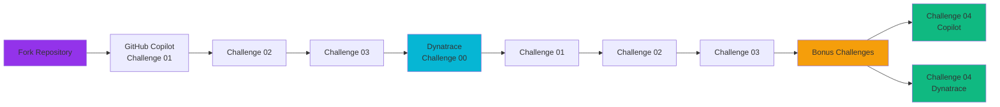

# Hackathon Challenges

Welcome to the Vegas Casino Observability Hackathon! This page provides an overview of all challenges organized by category.

## Challenge Structure

The hackathon is divided into two main tracks:

### GitHub Copilot Challenges

Learn how to leverage GitHub Copilot to improve your development workflow. These challenges focus on AI-assisted development and will help you master Copilot's capabilities.

**Recommended Order:**
1. [Introduction to GitHub Copilot](Challenge-01.md)
2. [Best Practices When Using Copilot](Challenge-02.md)
3. [Extending GitHub Copilot with Model Context Protocol](Challenge-03.md)

### Dynatrace Challenges

Improve instrumentation and observability using Dynatrace and Copilot. These challenges focus on observability best practices and Dynatrace platform features.

**Recommended Order:**
1. [Launching your Environment](DTChallenge-00.md)
2. [Prompt your observability data](DTChallenge-01.md)
3. [Improve your OpenTelemetry instrumentation](DTChallenge-02.md)
4. [Improve your Dynatrace Setup](DTChallenge-03.md)

### Bonus Challenges (Optional)

These challenges are optional and provide additional learning opportunities:

1. [Customizing GitHub Copilot in Your IDE](Challenge-04.md) - Advanced Copilot customization
2. [Build a Custom Dynatrace App](DTChallenge-04.md) - Create a custom Dynatrace application

## Getting Started

1. **Fork the Repository** - Fork [this repository](https://github.com/dynatrace-oss/Perform-Hackathon-2026) to your GitHub account
2. **Start with GitHub Copilot Challenges** - Begin with Challenge 01 to learn the fundamentals
3. **Move to Dynatrace Challenges** - After completing the Copilot challenges, start with DTChallenge-00 to set up your environment
4. **Make Changes** - Use Copilot to improve instrumentation and observability
5. **Deploy and Test** - Push changes to trigger GitHub Actions builds and update your deployment

## Challenge Overview

### GitHub Copilot Track

| Challenge | Description | Duration |
|-----------|-------------|----------|
| [Introduction to GitHub Copilot](Challenge-01.md) | Learn the basics of GitHub Copilot and build a Whack-a-Mole game | ~1 hour |
| [Best Practices When Using Copilot](Challenge-02.md) | Master prompt engineering and best practices | ~1 hour |
| [Extending GitHub Copilot with Model Context Protocol](Challenge-03.md) | Connect Copilot to GitHub via MCP | ~1 hour |

### Dynatrace Track

| Challenge | Description | Duration |
|-----------|-------------|----------|
| [Launching your Environment](DTChallenge-00.md) | Set up your Codespace and deploy the application | ~30 min |
| [Prompt your observability data](DTChallenge-01.md) | Learn to query Dynatrace data using Copilot | ~1 hour |
| [Improve your OpenTelemetry instrumentation](DTChallenge-02.md) | Enhance instrumentation with Copilot's help | ~1-2 hours |
| [Improve your Dynatrace Setup](DTChallenge-03.md) | Create dashboards, SLOs, and workflows | ~1-2 hours |

### Bonus Challenges (Optional)

| Challenge | Description | Duration |
|-----------|-------------|----------|
| [Customizing GitHub Copilot in Your IDE](Challenge-04.md) | Create custom instructions and agents | ~1 hour |
| [Build a Custom Dynatrace App](DTChallenge-04.md) | Create a custom Dynatrace app | ~2 hours |

## Learning Path

## Additional Resources

- **[Environment Setup](../deployment/devcontainer.md)**: Learn about the DevContainer environment
- **[Development Workflow](../development/source-code.md)**: Understand how to make changes and deploy
- **[Feature Flags Guide](../development/feature-flags.md)**: Learn about feature flags

---

**Ready to start?** Begin with [Introduction to GitHub Copilot](Challenge-01.md)!
